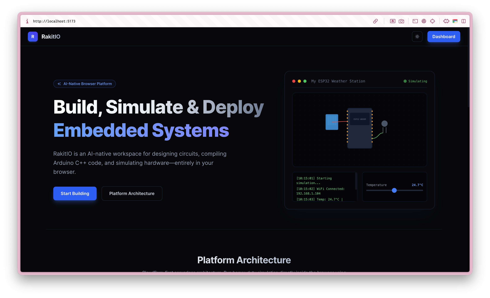
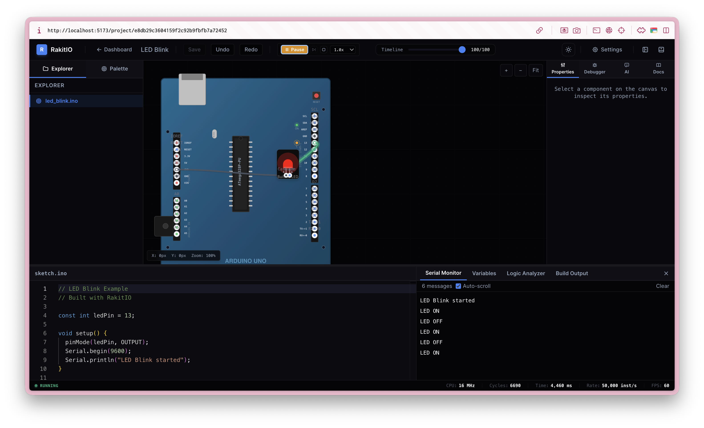
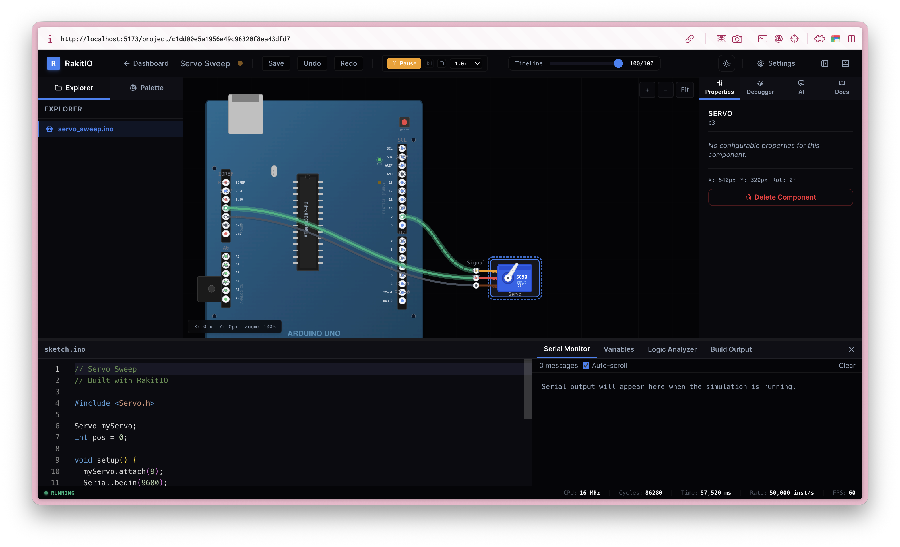

# RakitIO

AI-native **client-only** browser platform for designing, programming, wiring, simulating, and deploying embedded systems. No backend — the browser talks to Turso (libSQL) and AI providers directly.

## Tech Stack

| Layer | Stack |
|-------|-------|
| App | React 19, Vite 8, TypeScript 6, TailwindCSS 4, Zustand, TanStack Query, Monaco Editor, Framer Motion |
| Data | Turso (libSQL/SQLite) over HTTP via `@libsql/client` + Drizzle ORM, called directly from the browser |
| Simulation | Custom C++ parser → IR → VM, netlist solver, device SDK, running in a Web Worker |
| AI | Bring-your-own-key, OpenAI-compatible providers (OpenAI, Anthropic, Gemini, OpenRouter, custom) called directly from the browser |

> ⚠️ **Security note:** Because there is no server, the Turso auth token is
> bundled into the client and exposed to users. Ownership is enforced at the
> application layer only (queries filter by `userId`). Use a token with minimal
> permissions. See `spec/RFC0001` for the full tradeoff analysis.

## Screenshots

<table>
  <tr>
    <td width="33.33%" align="center"><b>Landing</b></td>
    <td width="33.33%" align="center"><b>LED Blink</b></td>
    <td width="33.33%" align="center"><b>Servo Sweep</b></td>
  </tr>
  <tr>
    <td width="33.33%"></td>
    <td width="33.33%"></td>
    <td width="33.33%"></td>
  </tr>
</table>

## Project Structure

```
rakit-io/
├── src/
│   ├── components/        # UI components
│   ├── pages/             # Route pages (Landing, Auth, Dashboard, Editor)
│   ├── lib/
│   │   ├── db/            # Drizzle schema + libSQL (Turso) browser client
│   │   ├── svg/           # SVG board & component renderers
│   │   ├── simulator/     # C++ parser, IR, VM, netlist, device SDK
│   │   ├── stores/        # Zustand stores (auth, project, simulation, ui)
│   │   ├── hooks/         # TanStack Query hooks
│   │   ├── api.ts         # Data + AI access layer (Turso / providers)
│   │   └── types.ts
│   └── workers/           # Simulation Web Worker
├── scripts/
│   ├── migrate.ts         # Idempotent schema creation
│   └── seed.ts            # Demo user + example projects
└── spec/                  # Architecture RFCs
```

## Getting Started

### Prerequisites

- [Bun](https://bun.sh) v1.4+
- [Turso](https://turso.tech) database (free tier works)

### 1. Install Dependencies

```bash
bun install
```

### 2. Set Up Turso Database

```bash
curl -sSfL https://get.tur.so/install.sh | bash
turso auth login
turso db create rakit-io-db
turso db show rakit-io-db --url      # connection URL
turso db tokens create rakit-io-db   # auth token
```

### 3. Configure Environment

Copy `.env.example` to `.env` and fill in your Turso credentials (and an
optional default AI key):

```env
VITE_TURSO_URL=libsql://<your-db>.turso.io
VITE_TURSO_AUTH_TOKEN=<your-token>
VITE_AI_BASE_URL=https://api.openai.com/v1
VITE_AI_API_KEY=
VITE_AI_MODEL=gpt-4o-mini
```

### 4. Create Tables & Seed

```bash
export TURSO_URL="libsql://<your-db>.turso.io"
export TURSO_AUTH_TOKEN="<your-token>"

bun run migrate        # create users, sessions, projects, ai_providers
bun run seed           # demo user + 8 example projects
```

### 5. Run Development

```bash
bun dev                # Vite dev server on http://localhost:5173
```

## Demo Credentials

| Field | Value |
|-------|-------|
| Email | `demo@rakit.io` |
| Password | `demo1234` |

The demo account comes pre-seeded with example projects: LED Blink, DHT22
Weather Station, Servo Sweep, Button LED, Potentiometer, Servo Knob, BME280
Monitor, OLED Hello World.

## Scripts

```bash
bun dev          # Start Vite dev server
bun build        # Production build (tsc + vite)
bun typecheck    # Typecheck
bun lint         # Lint with oxlint
bun migrate      # Create/ensure DB schema
bun seed         # Seed demo data
bun deploy       # Build and deploy to Cloudflare Pages
bun pages:dev    # Build and run locally via Wrangler Pages
```

## Deployment (Cloudflare Pages)

The build output in `dist/` is a fully static SPA deployed to Cloudflare Pages
via Wrangler. `wrangler.toml` points Pages at `dist/`, and
`public/_redirects` ensures client-side routes fall back to `index.html`.

1. **Set build-time environment variables** in the Cloudflare Pages dashboard
   (Settings → Environment variables) for both Production and Preview, or pass
   them on deploy. These are baked into the static bundle:

   ```env
   VITE_TURSO_URL=libsql://<your-db>.turso.io
   VITE_TURSO_AUTH_TOKEN=<your-token>
   VITE_AI_BASE_URL=https://api.openai.com/v1
   VITE_AI_API_KEY=
   VITE_AI_MODEL=gpt-4o-mini
   ```

2. **Authenticate** once:
   ```bash
   npx wrangler login
   ```

3. **Deploy:**
   ```bash
   bun deploy
   # or, with inline env vars for a one-off:
   npx wrangler pages deploy dist --var VITE_TURSO_URL:... --var VITE_TURSO_AUTH_TOKEN:...
   ```

## Supported Boards

- Arduino Uno (Nano, Mega), ESP32 DevKit V1, ESP8266 NodeMCU, Raspberry Pi Pico

## Supported Components

LED, Button, Resistor, Potentiometer, DHT22, BME280, SSD1306 OLED, Servo, RGB LED, Ultrasonic, LCD 16x2, Buzzer, Relay.

## License

MIT
